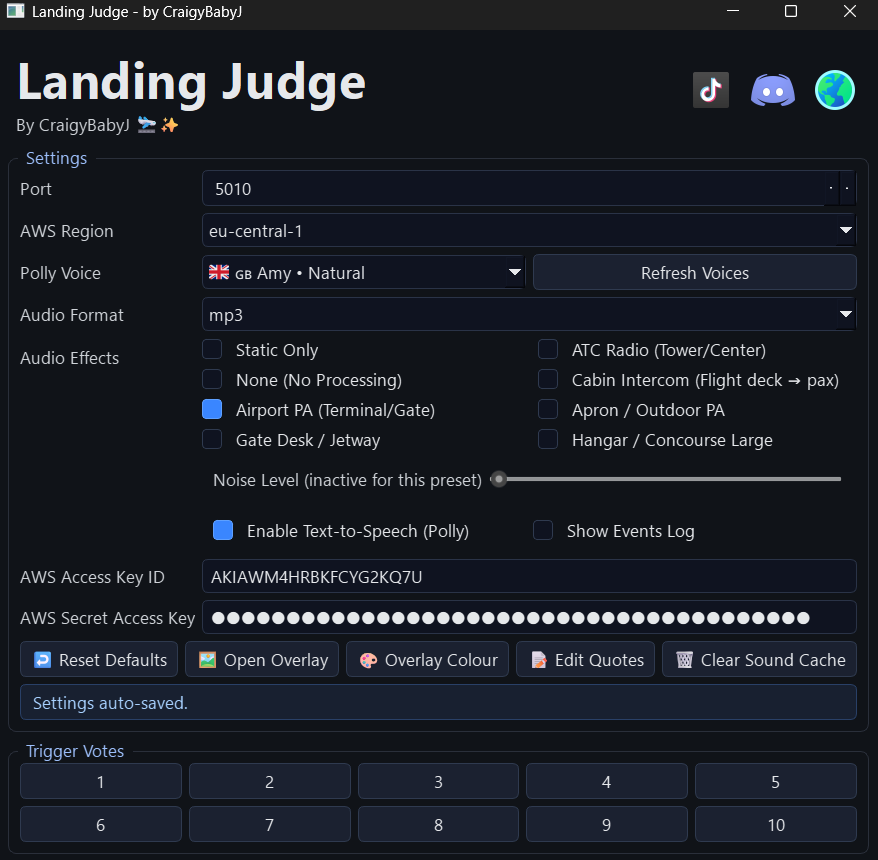
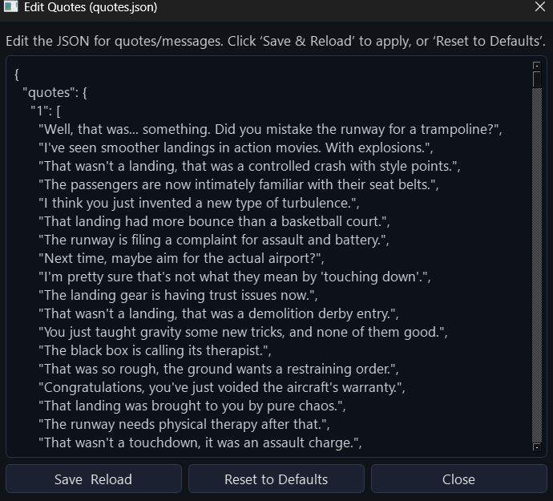
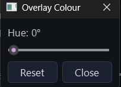
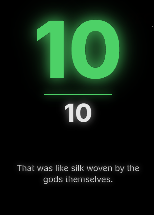

# Landing Judge

A playful, local overlay and control app for rating landings from 1–10 — complete with a snappy on‑screen banner, witty quotes, and optional text‑to‑speech. Perfect for group flying nights, VA events, VATSIM/IVAO meet‑ups, or casual squad sessions where you rate each other’s landings and keep the banter flowing.

Use it to crown the “butter king,” call out the “firm” arrivals, and add a bit of personality to your stream or Discord. Lightweight, fast, and streamer‑friendly.

## Features
- Animated overlay banner with tiered colors and subtle motion.
- Witty quote per score, plus optional Amazon Polly TTS playback.
- Fixed, client‑side banner visibility (defaults to 2000 ms) for predictable pacing.
 - If audio is disabled, the overlay holds visibly for 2000 ms before hiding.
- One‑click Desktop UI for settings and testing votes.
- Stream Deck integration for 10 fast vote buttons.
- Simple API (`GET /vote/<score>`) for external triggers.
- Editable quotes (`quotes.json`) with a safe default backup (`quotes.default.json`).

## Quick Start
1. Install Python 3.10+.
2. Install dependencies:
   ```powershell
   pip install -r requirements.txt
   ```
3. Run the server:
   ```powershell
   python all_in_one.py
   ```
4. Open the overlay in a browser or OBS Browser Source:
   - URL: `http://127.0.0.1:5005/overlay`
5. Trigger a test vote (1–10):
   ```powershell
   curl "http://127.0.0.1:5005/vote/8"
   ```

Pro tip: The overlay is transparent until a vote or preview is triggered.

## Using the Prebuilt Windows EXE
If you don’t want to build locally, grab the prebuilt EXE from GitHub Releases and run it directly—no Python needed.

1. Download the latest release ZIP from the “Releases” page.
2. Unzip to a folder you control (e.g., `C:\Apps\LandingJudge`).
3. Double‑click the EXE to start the local server.
   - If Windows SmartScreen warns about an unknown publisher, choose “More info” → “Run anyway”.
   - If prompted by Windows Firewall, allow access on Private networks.
4. Open the overlay in OBS or a browser: `http://127.0.0.1:5005/overlay`.
5. Trigger votes using the URLs `http://127.0.0.1:5005/vote/1..10` or set up Stream Deck (see below).

Notes:
- Audio/TTS is optional. To enable TTS, set AWS credentials and voice in `.env` (you can create one next to the EXE, see the “Configuration” section).
- Keep the `static/` and `templates/` folders alongside the EXE if they are included in the ZIP. They provide the overlay CSS/JS and HTML. If your ZIP only has the EXE, you can copy `static/` and `templates/` from this repo into the same folder as the EXE.
- Quotes are loaded from `quotes.json` next to the EXE. You can edit it to customize messages; a backup `quotes.default.json` is also supported.
- When audio is disabled, the banner stays visible for ~2 seconds; with audio, it hides 2 seconds after playback ends.

## Environment Setup
Copy the sample file and edit values as needed:

```powershell
Copy-Item .env.sample .env
# then open .env and set AWS keys if you use TTS
```

## Publish to GitHub
Make the repo public and push it to GitHub as `landing-judge`.

1. Create a new public repo on GitHub named `landing-judge`.
2. In the project folder, initialize and commit locally:
   ```powershell
   git init
   git add .
   git commit -m "Public release: Landing Judge"
   ```
3. Add the remote and push:
   ```powershell
   git branch -M main
   git remote add origin https://github.com/<your-username>/landing-judge.git
   git push -u origin main
   ```
4. Update your Stream Deck profile and OBS scene names to match “Landing Judge” if desired.

## Desktop UI
The optional control panel lets you edit `.env` settings, open the overlay, and trigger votes.

Run it:
```powershell
python ui.py
```

What you can adjust:
- `Port`: Overlay/API server port (restart required after change).
- `AWS Region`, `Polly Voice`, `Audio Format (mp3|wav)`: Amazon Polly TTS options.
- `Enable TTS`: Toggle audio generation/playback for quotes.
- `AWS Access Key ID` and `AWS Secret Access Key`: Credentials for Polly.
- `Audio Effects` presets: None, Airport PA, Gate Desk/Jetway, ATC Radio,
  Cabin Intercom, Apron/Outdoor PA, Hangar/Concourse Large.
- `Static Only`: Toggle to play only static noise (mutually exclusive with presets).
- `Noise Level`: Slider to adjust the noise bed level for the active effect.
- `Show Events Log`: Show/hide the live events (SSE) panel in the UI.

Additional actions:
- `Open Overlay`: Launch the overlay page in your browser.
- `Overlay Colour`: Adjust overlay hue with a live preview dialog.
- `Edit Quotes`: Open a simple editor for `quotes.json`.
- `Clear Sound Cache`: Delete all generated `.mp3`/`.wav` files in `static/audio/`
  and remove `audio_index.json` (recreated automatically on next audio generation).
- `Reset Defaults`: Restore opinionated defaults and persist to `.env`.

Buttons 1–10 trigger `GET /vote/<score>` so you can test without Stream Deck.

## Stream Deck Setup
You have two easy options. The built‑in “Website” action works out of the box; an HTTP plugin avoids opening a browser.

Option A — Built‑in Website action (simple):
1. Open Stream Deck and create or select a profile for your stream.
2. Drag “Website” onto a blank button.
3. Set “URL” to `http://127.0.0.1:5005/vote/1` and title the button `1`.
4. Duplicate the button and update the URL to `/vote/2`, `/vote/3`, … up to `/vote/10`.
5. Keep `all_in_one.py` running while streaming.

Note: The Website action may open a browser tab on press. If you prefer a silent request, use Option B.

Option B — HTTP GET plugin (silent requests):
1. Install a lightweight HTTP request plugin (e.g., “BarRaider’s HTTP Request”).
2. Drag the HTTP action onto a button.
3. Set Method to `GET` and URL to `http://127.0.0.1:5005/vote/1`.
4. Title the button `1` and repeat for scores `2`–`10`.
5. Ensure Landing Judge is running so the overlay receives the votes.

Tips:
- Place buttons 1–10 in a single row for muscle memory.
- Use icons/colors to match tiers (bad/ok/good/great) if you like.
- Test with the Desktop UI first to confirm overlay and audio behave as expected.

## Screenshots
Add images to `static/screenshots/` and they’ll render in this section.

- 
- 
- 
- 


## Overlay in OBS
- Add a Browser Source with URL `http://127.0.0.1:5005/overlay`.
- Set size to your canvas (e.g., 1920×1080). The overlay is transparent when idle.
- Enable “Refresh browser when scene becomes active” if you switch scenes often.
- If you want overlay audio, ensure your Browser Source audio is monitored/mixed in OBS.
- Note: OBS Browser Source auto-plays overlay audio without any clicks. Regular browsers may require muted autoplay or a user interaction, but in OBS it works out of the box.


## API Example
```bash
curl "http://127.0.0.1:5005/vote/8"
```
Sample response (overlay consumes `quote`, `audio_url`, `score`, `level`):
```json
{
  "type": "vote",
  "score": 8,
  "quote": "That was the sweet spot of aviation sass.",
  "audio_url": "/static/audio/quote_abc123.mp3",
  
  "level": "good",
  "ts": "2025-09-30T16:48:09Z"
}
```

## Configuration (.env)
Common environment variables (managed by the Desktop UI):
- `PORT`: HTTP server and overlay port (default `5005`).
- `ENABLE_TTS`: `true|false` to enable Text‑to‑Speech for quotes.
- `AWS_REGION`: Amazon Polly region, e.g., `us-east-1`.
- `POLLY_VOICE_ID`: Polly voice, e.g., `Joanna`.
- `POLLY_OUTPUT_FORMAT`: Audio format, e.g., `mp3`.
- `ADD_STATIC_NOISE`: Add static noise bed (`true|false`).
- `EFFECT_PRESET`: Audio processing preset name (`none`, `tower_radio`, `apron_outdoor`, etc.).
- `STATIC_NOISE_LEVEL`, `RADIO_NOISE_LEVEL`, `WIND_NOISE_LEVEL`: Per‑effect levels.

## Quotes
- `quotes.json` holds `quotes` (arrays by score 1–10).
- The overlay displays the selected `quote` string and plays `audio_url` if available.
- Resetting to defaults uses `quotes.default.json` (a full backup of the original set). If it’s missing, a minimal fallback is used.

Editing quotes:
1. Stop the server.
2. Edit `quotes.json` (keep `quotes` present).
3. Start the server and test votes.

## Troubleshooting
- Overlay not showing: Confirm the URL, port, and that a vote/preview has been triggered.
- No audio: Ensure TTS is enabled, AWS credentials are set, and OBS browser audio is routed.
- Stream Deck buttons do nothing: Verify the server is running and URLs are `http://127.0.0.1:5005/vote/<1..10>`.
- Quotes missing: Restore `quotes.default.json` and use the reset function, or copy its contents back to `quotes.json`.

## License
This project is provided as‑is for personal streaming and coaching use.